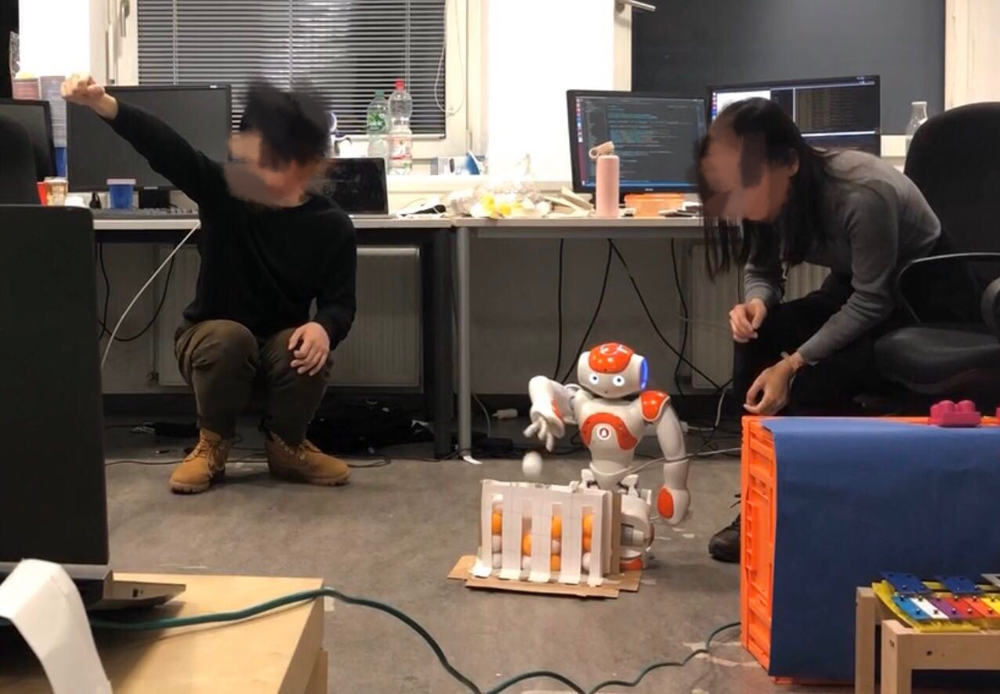
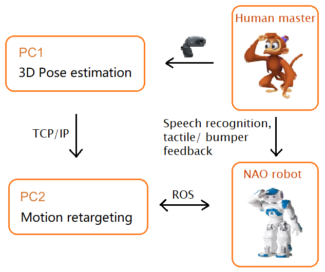
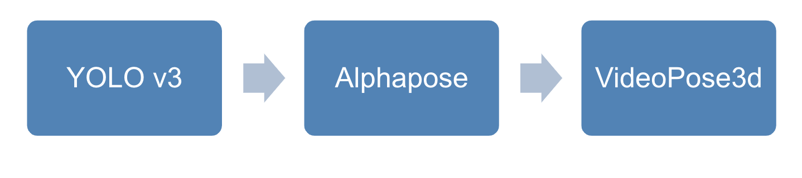

# Introduction
The objective of this project is to teleoperate the NAO robot to play connect-four against a human. In each round of the game, NAO will first grab a ping-pong ball of a specific color as a game token, then imitate the movement of the human master, which is observed by a monocular camera, walking to
the game board and dropping the token into the desired slot in order to win the game.

<p align="center">
    
    <br>
    <sup>NAO playing connect four via teleoperation</sup>
</p>

# Requirements

- PC 1 with a rgb camera:

  python 3.6

  cuda (tested with version 10.1)

  pytorch (tested with version 1.4)

- PC 2:

  python 2.7

  ROS (tested with version kinetic)

- Internet connection bwtween PC 1 and PC 2.


# Usage

1. On PC1:

   ```
   $ python videopose.py
   ```

2. On PC2:

   ```
   $ roslaunch nao_bringup nao_full.launch
   $ roslaunch final_project nao.launch
   ```


 Please make sure to first launch the process on PC 1.  
 If process on one of the PC crashes, please also terminate the process on another PC and then relaunch everything.

# Methods

Since the 3D human pose estimation using deep neural network is very computationally intensive, we use a non-ros computer with strong GPU to perform the pose estimation, and another computer with ros to commu-
nicate with NAO humanoid robot. The connection between these two computers is established using TCP/IP.

<p align="center">
    
    <br>
    <sup>System architecture</sup>
</p>

## 1. 3D Human Pose Estimation [1]
The 3D human pose is estimated by employing a three-stage deep neural network. Firstly, YOLO v3 detects the person on the rgb images. next, Alphapose extracts 2D human keypoints of the detected person. Based on the 2D keypoints, the last network, VideoPose3d is able to estimate 3D human keypoints. 
<p align="center">
    
    <br>
    <sup>3D pose estimation pipeline</sup>
</p>

## 2. Motion Retargeting [2]
The retargeting of the arm motion
is done by replicating the corresponding joint angles
from the estimated 3D human model to the
robot joint space.   

Besides the arm motion, we can also remote control the robot to walk, by sending the command of target velocity
to the robot when detecting that the human master is walking
or turning. 
# References
[1] Pavllo, Dario, et al. ”3D human pose estimation in video with temporal
convolutions and semi-supervised training.” Proceedings of the IEEE
Conference on Computer Vision and Pattern Recognition. 2019.  

[2] Franz, Sven, Ralph Nolte-Holube, and Frank Wallhoff. "NAFOME: NAO Follows Me-tracking, reproduction and simulation of human motion." Jade University of Applied Sciences, Germany (2013).